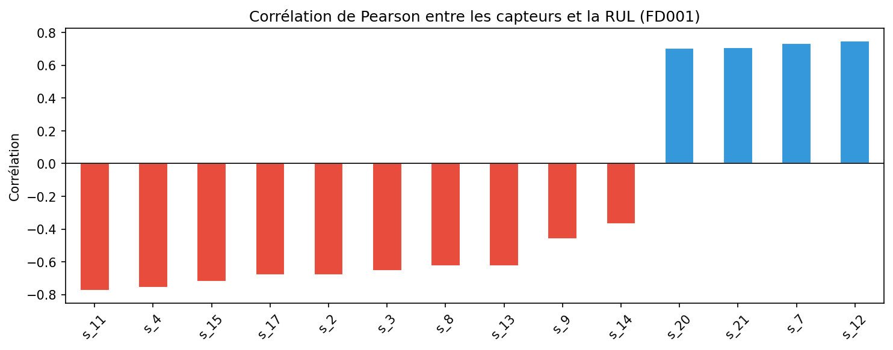
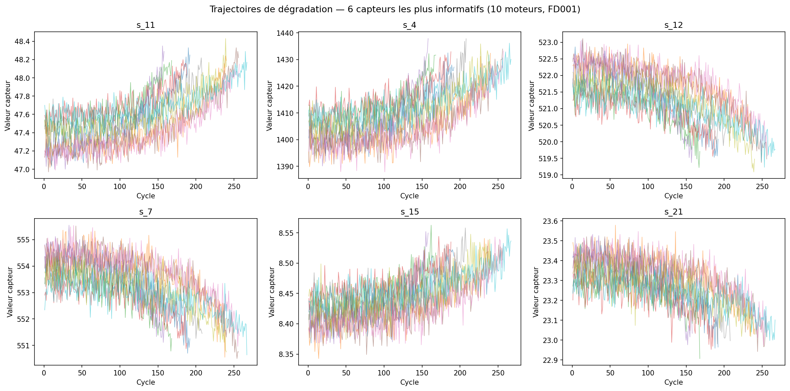

# Maintenance Prédictive — Turbofans NASA (CMAPSS)

Ce projet explore l'application du **reinforcement learning** à la maintenance prédictive de moteurs à réaction, à partir du dataset CMAPSS de la NASA.

---

## Justification Business

La défaillance imprévue d'un moteur d'avion coûte en moyenne plusieurs centaines de milliers d'euros — entre les immobilisations, les réparations d'urgence et les perturbations opérationnelles. À l'inverse, une politique de maintenance trop conservatrice génère des interventions inutiles et fait exploser les coûts.

L'objectif est de trouver le bon équilibre : **signaler un moteur pour maintenance au bon moment**, ni trop tôt (faux positifs coûteux), ni trop tard (panne catastrophique). Un agent RL est particulièrement adapté à ce problème car il apprend directement à optimiser ce compromis à partir de données historiques.

---

## Données — CMAPSS (NASA)

Le dataset **CMAPSS** (Commercial Modular Aero-Propulsion System Simulation) contient des séries temporelles de capteurs simulant la dégradation de moteurs jusqu'à leur défaillance. Il comprend 4 sous-ensembles (FD001–FD004) de complexité croissante.

**Capteurs disponibles :** 21 capteurs au total, dont 7 constants (inutilisables) écartés — il reste **14 capteurs actifs** mesurant des grandeurs comme la température, la pression et le débit à différents étages du moteur.

**Prétraitement :**
- Moyenne glissante sur 30 cycles par moteur pour lisser le bruit
- Normalisation MinMax sur les 14 capteurs actifs
- La durée de vie résiduelle (RUL) est calculée comme `max_cycle − cycle`, plafonnée à 125

---

## Aperçu des données

**Corrélation des capteurs avec la RUL** — les capteurs en bleu augmentent avec la durée de vie restante, ceux en rouge diminuent. Cela guide le choix des features pertinentes.



**Trajectoires de dégradation** — évolution des 6 capteurs les plus informatifs sur 10 moteurs aléatoires. On observe clairement la tendance de dégradation au fil des cycles.



---

## Formulation RL

| Concept RL | Correspondance |
|---|---|
| **État** `s` | Vecteur de 14 capteurs normalisés au cycle courant |
| **Action** `a` | `0` = continuer, `1` = signaler pour maintenance |
| **Récompense** `r` | Voir tableau ci-dessous |
| **Épisode** | La vie complète d'un moteur, du cycle 1 jusqu'à la panne |
| **Done** | Dernier cycle enregistré du moteur |

**Fonction de récompense** — asymétrique pour pénaliser davantage les faux négatifs :

| Action | RUL > 30 | RUL ≤ 30 |
|---|---|---|
| `0` — continuer | +1.0 | **−10.0** ← manquer une panne imminente |
| `1` — signaler | −3.0 ← fausse alarme | **+5.0** |

La pénalité de −10 reflète le coût business d'une défaillance non anticipée, bien supérieur à celui d'une fausse alarme (−3).

---

## Installation & Lancement

**Prérequis :** Python 3.9+

```bash
# Cloner le dépôt
git clone https://github.com/luxchar/nasa-turbofan-offline-rl.git
cd nasa-turbofan-offline-rl

# Installer les dépendances
pip install -r requirements.txt
pip install torch jupyter

# Lancer JupyterLab
jupyter lab src/
```

Les notebooks sont à exécuter dans l'ordre :

```
01_eda.ipynb               ← analyse exploratoire (à lancer en premier)
02_q_learning.ipynb        ← Q-Learning tabulaire
03_deep_q_learning.ipynb   ← DQN (nécessite torch)
```

> Les données CMAPSS doivent être placées dans `data/CMaps/` (fichiers `train_FD00*.txt`, `test_FD00*.txt`, `RUL_FD00*.txt`).

---

## Arborescence

```
nasa-turbofan-offline-rl/
├── data/
│   └── CMaps/             ← données brutes CMAPSS (NASA)
├── models/                ← modèles sauvegardés (.pt)
├── src/
│   ├── 01_eda.ipynb
│   ├── 02_q_learning.ipynb
│   └── 03_deep_q_learning.ipynb
├── app.py                 ← application Streamlit
├── requirements.txt
└── README.md
```

---

## Approche

Trois approches sont comparées, chacune dans un notebook dédié :

| Notebook | Méthode |
|---|---|
| `01_eda.ipynb` | Analyse exploratoire des données |
| `02_q_learning.ipynb` | Q-Learning tabulaire |
| `03_deep_q_learning.ipynb` | Dueling Double DQN (PyTorch) |

---

## Hyperparamètres clés

| Paramètre | Valeur | Rôle |
|---|---|---|
| `FLAG_THRESHOLD` | 30 cycles | En-dessous de ce seuil, le moteur est considéré en danger |
| `RUL_CAP` | 125 cycles | Plafond de la RUL — au-delà le moteur est considéré comme neuf |
| `W` | 30 cycles | Fenêtre de la moyenne glissante pour lisser les capteurs |
| `GAMMA` | 0.97 | Facteur d'actualisation — valorise les récompenses futures |
| `EPS_START / EPS_END` | 1.0 → 0.05 | Taux d'exploration initial et final (ε-greedy) |
| `N_EPISODES` | 200 | Nombre de passages sur la flotte de moteurs |
| `BUFFER_SIZE` | 50 000 | Capacité du replay buffer |
| `BATCH_SIZE` | 256 | Taille des mini-batchs lors de l'entraînement |
| `LR` | 1e-3 | Taux d'apprentissage de l'optimiseur Adam |

---

## Résultats

| Méthode | Accuracy (FD001) | Note |
|---|---|---|
| Q-Learning tabulaire | 53 % | Recall parfait sur "flag" (1.00) mais beaucoup de faux positifs |
| Dueling Double DQN | **88 %** | Bon équilibre précision / recall sur les deux classes |

Le Q-Learning identifie tous les moteurs en danger mais génère trop d'alarmes inutiles. Le DQN, grâce à l'exploration ε-greedy et un environnement de simulation, apprend un comportement bien plus nuancé — sans jamais accéder directement à la durée de vie résiduelle (RUL).
